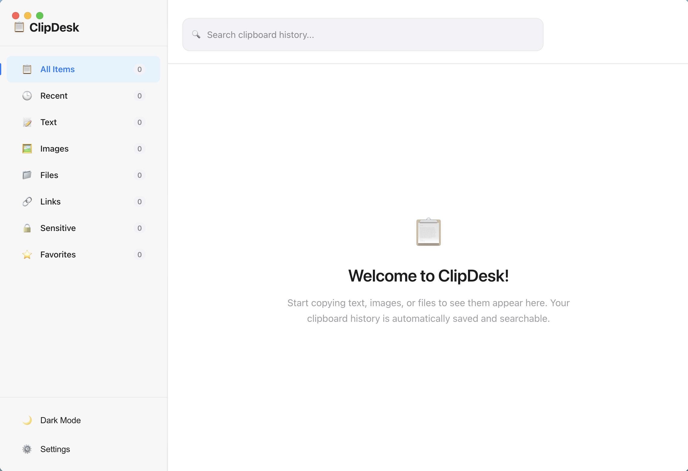

# ClipDesk

A local-first clipboard manager for macOS, Windows, and Linux. Inspired by [Things](https://culturedcode.com/things/) and [Paste](https://pasteapp.io/).



## Features

- **Clipboard history** — automatically captures text, images, files, links, and color values
- **Instant search** — find any clipboard item with real-time fuzzy search
- **Smart filters** — browse by content type, source app, or date
- **Favorites** — pin important items so they're never deleted
- **Sensitive data detection** — automatically flags API keys, passwords, credit cards, and tokens
- **Dark and light themes** — clean, Things-inspired UI with smooth animations
- **Menubar mode** — runs in the background with a global shortcut (`Cmd+Shift+V` / `Ctrl+Shift+V`)
- **Launch at login** — starts automatically and stays out of the way
- **Auto-updates** — checks for new versions via GitHub Releases
- **Cross-platform** — builds for macOS (DMG), Windows (NSIS), and Linux (AppImage)

## Getting Started

### Prerequisites

- Node.js 20+
- npm

### Development

```bash
git clone https://github.com/aadivar/clipdesk.git
cd clipdesk
npm install
npm run prisma:generate
npm run build:main
npm run electron:dev
```

The app will start in dev mode with hot reload for the renderer process.

> **Note (macOS):** Grant accessibility permissions in System Settings > Privacy & Security > Accessibility for clipboard monitoring to work.

## Scripts

| Command | Description |
|---|---|
| `npm run electron:dev` | Start in development mode |
| `npm run build` | Full production build with packaging |
| `npm run build:mac` | Build for macOS |
| `npm run build:win` | Build for Windows |
| `npm run build:linux` | Build for Linux |
| `npm run prisma:generate` | Generate Prisma client |
| `npm run prisma:migrate` | Run database migrations |
| `npm run type-check` | TypeScript type checking |
| `npm run lint` | Lint with ESLint |
| `npm run test` | Run tests with Vitest |

## Project Structure

```
src/
  main/                  Electron main process
    index.ts             App entry, window management, IPC
    clipboardMonitor.ts  Clipboard polling and capture
    sensitiveDataDetector.ts  Pattern-based sensitive data detection
    autoUpdater.ts       electron-updater integration
  preload/
    index.ts             IPC bridge between main and renderer
  renderer/
    App.tsx              Main React UI
    components/          UI components
  shared/
    database.ts          Prisma/SQLite database layer
    types.ts             Shared TypeScript types
prisma/
  schema.prisma          Database schema
assets/                  App icons and tray icons
```

## Tech Stack

- **Electron** — desktop framework
- **React** + **TypeScript** — UI
- **Styled Components** — styling
- **Prisma** + **SQLite** — local database
- **Vite** — build tooling
- **electron-builder** — packaging and distribution
- **electron-updater** — auto-updates via GitHub Releases
- **GitHub Actions** — CI/CD

## Releasing

Releases are automated via GitHub Actions. When a version tag is pushed, builds are created for all platforms and published to GitHub Releases.

```bash
# Bump version and push tag
npm version patch   # or minor / major
git push origin main --tags
```

The workflow builds macOS (DMG + ZIP), Windows (NSIS + ZIP), and Linux (AppImage + tar.gz) artifacts and uploads them to the GitHub release. Users with the app installed receive update notifications automatically.

## Privacy

ClipDesk is local-first. All clipboard data is stored in a SQLite database on your device. Nothing is sent to any server.

## Contributing

1. Fork the repository
2. Create a feature branch
3. Make your changes
4. Run `npm run type-check && npm run lint` to verify
5. Open a pull request

## License

[MIT](LICENSE)

## Acknowledgments

- [Things](https://culturedcode.com/things/) — design inspiration
- [Paste](https://pasteapp.io/) — feature inspiration
